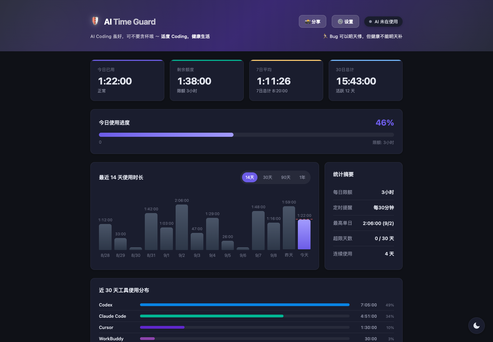
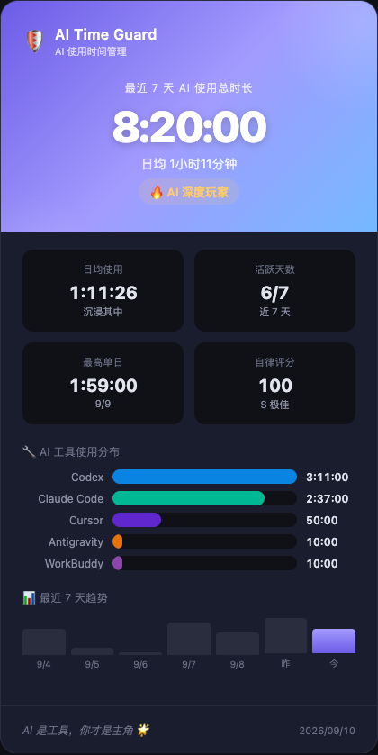

# AI Time Guard

> A local-first macOS menu bar app that measures time spent in AI coding tools,
> adds a daily limit, and turns the result into a clear dashboard.



AI Time Guard helps you notice when an AI-assisted coding session has quietly
become an all-day session. It detects supported desktop apps and terminal tools
only while they are actively in use, keeps all data on your Mac, and provides a
dashboard plus a shareable report card.

## Highlights

- Tracks active time across Codex, Claude Code, Cursor, CodeBuddy, WorkBuddy,
  Antigravity, Kimi, Windsurf, Trae, Zed, and selected AI-assisted note apps.
- Sets a daily time budget with warning, periodic reminder, and strict modes.
- Shows daily, monthly, and yearly trends in a responsive local dashboard.
- Produces a share card without sending usage history to a remote service.
- Stores configuration and history locally in `~/.ai-time-guard/`.



## Requirements

- macOS 12 or later
- Python 3.9 or later
- Accessibility permission for detecting the frontmost app
- Optional: Playwright and Chromium for PNG export

## Install and run

```bash
git clone https://github.com/yafeishi/ai-time-guard.git
cd ai-time-guard
python3 -m venv .venv
source .venv/bin/activate
pip install -r requirements.txt
python ai_time_guard.py
```

Open <http://127.0.0.1:19527> for the dashboard. You can also double-click the
included `AI Time Guard.app` after the virtual environment has been created in
the repository directory.

For image export, install the optional browser dependency:

```bash
pip install playwright
playwright install chromium
```

## How tracking works

AI Time Guard combines the current frontmost macOS application with a lightweight
process check. GUI tools count only while their app is in the foreground. CLI
tools count only while a supported terminal is in the foreground and the tool's
process is running. Checks run every 10 seconds by default.

The app records only duration and tool category. It does **not** capture prompts,
source code, keystrokes, screenshots, or window contents.

## Local API

The server listens on `127.0.0.1:19527` and exposes these endpoints:

| Endpoint | Method | Purpose |
| --- | --- | --- |
| `/api/report` | GET | Full history, configuration, and current status |
| `/api/today` | GET | Lightweight summary for today |
| `/api/daily/YYYY-MM-DD` | GET | One day's usage |
| `/api/summary?days=N` | GET | Daily aggregation, up to 365 days |
| `/api/summary/monthly?months=N` | GET | Monthly aggregation, up to 120 months |
| `/api/summary/yearly?years=N` | GET | Yearly aggregation, up to 20 years |
| `/api/config` | GET, POST | Read or update local settings |
| `/api/generate-image?type=share\|card` | GET | Export a PNG with Playwright |

Example:

```bash
curl -s http://127.0.0.1:19527/api/today | python3 -m json.tool
curl -s "http://127.0.0.1:19527/api/generate-image?type=card" -o card.png
```

The API is intentionally unauthenticated for local integrations. Do not expose
port `19527` to the internet. See [SECURITY.md](SECURITY.md) for details.

## Data and configuration

| File | Description |
| --- | --- |
| `~/.ai-time-guard/config.json` | Limits, reminder behavior, theme, and interval |
| `~/.ai-time-guard/history.json` | Daily totals and per-tool durations |
| `~/.ai-time-guard/debug.log` | Local diagnostic log |

Delete the directory to remove all local AI Time Guard data.

## Development

```bash
python -m unittest discover -s tests -v
```

The interface is implemented with dependency-free HTML, CSS, and JavaScript;
the menu bar service and local API live in `ai_time_guard.py`.

## Limitations

- App and process names are heuristic and may change between tool releases.
- The included `.app` bundle is an unsigned launcher, not a notarized build.
- Sleep, crashes, or force-quitting between history flushes can lose up to one
  minute of the latest session.
- AI Time Guard is a personal awareness tool, not employee-monitoring software.

## License

[MIT](LICENSE)

### 站立提醒与记录

站立弹窗提供「我已经站立」和「知道了」两个按钮。确认已经站立后记录一次实际站立，并从确认时间开始下一轮倒计时；选择「知道了」会保留待站立状态，每 5 分钟再次提醒。关闭弹窗后，可从「站立提醒 → 我已经站立（记录一次）」补记。

报告显示今日提醒次数、实际站立次数和最近 7 天的每日统计。每次提醒和站立确认的时间保存在 `~/.ai-time-guard/stand-up.json`，应用重启后仍然保留。手动「立即提醒一次」也会计入提醒次数。旧版本没有采集这些事件，因此无法补回此前的站立记录。
